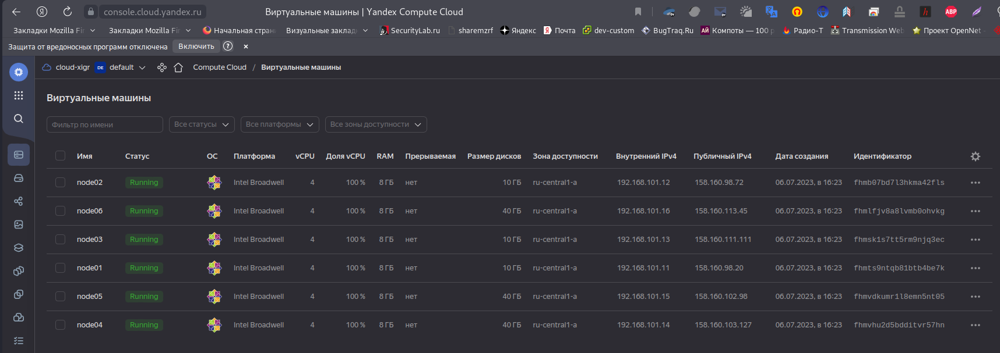
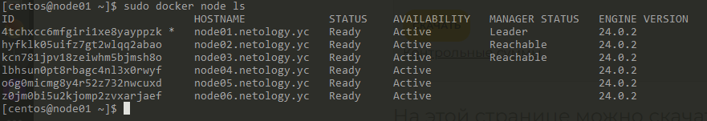
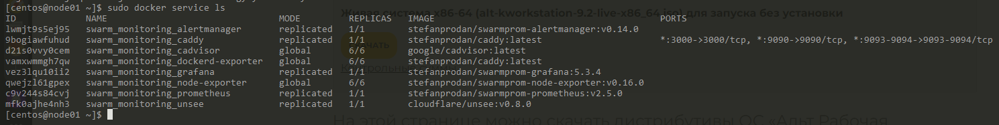

# Домашнее задание к занятию "`Оркестрация кластером Docker контейнеров на примере Docker Swarm`" - `Живарев Игорь`


### Задание 1

Дайте письменые ответы на вопросы:

1. В чём отличие режимов работы сервисов в Docker Swarm-кластере: replication и global?
2. Какой алгоритм выбора лидера используется в Docker Swarm-кластере?
3. Что такое Overlay Network?


Ответ:

1. В режиме кластера существует два типа служб: службы репликации и глобальные службы. Для служб репликации вы можете указать количество задач репликации, которые диспетчер кластера будет планировать на доступных узлах. Для глобальных сервисов планировщик размещает задачу на каждом доступном узле, чтобы удовлетворить ограничения расположения сервиса и требования к ресурсам.

2. Отказоустойчивость сервиса гарантируется самим Docker. Это достигается в том числе за счет того, что в кластере могут одновременно работать несколько управляющих нод, которые могут в любой момент заменить вышедшего из строя лидера. Если говорить более подробно, то используется так называемый алгоритм поддержания распределенного консенсуса — Raft.

3. Overlay network : Создает внутреннюю частную сеть, которая охватывает все узлы, участвующие в кластере swarm. Таким образом, оверлейные сети облегчают обмен данными между сервисом Docker Swarm и автономным контейнером или между двумя автономными контейнерами на разных демонах Docker.

```
Поле для вставки кода...
....
....
....
....
```

---

### Задание 2

Создайте ваш первый Docker Swarm-кластер в Яндекс Облаке.

Чтобы получить зачёт, предоставьте скриншот из терминала (консоли) с выводом команды:

```
docker node ls
```


Ответ:






---

### Задание 3


Создайте ваш первый, готовый к боевой эксплуатации кластер мониторинга, состоящий из стека микросервисов.

Чтобы получить зачёт, предоставьте скриншот из терминала (консоли), с выводом команды:

```
docker service ls
```


Ответ:


